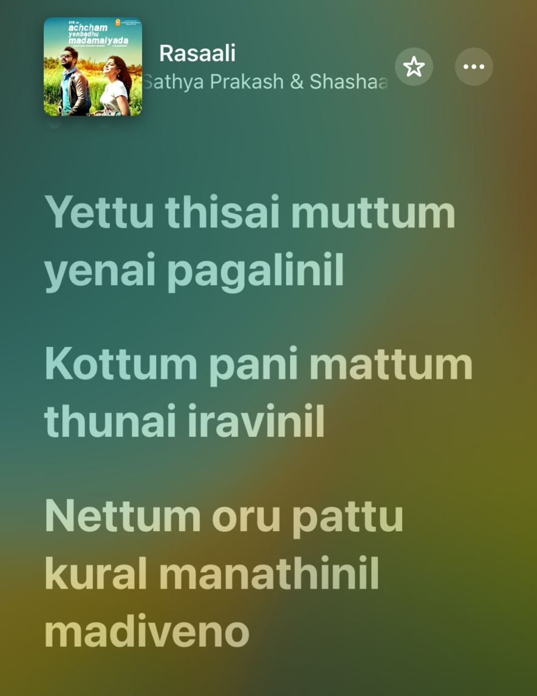
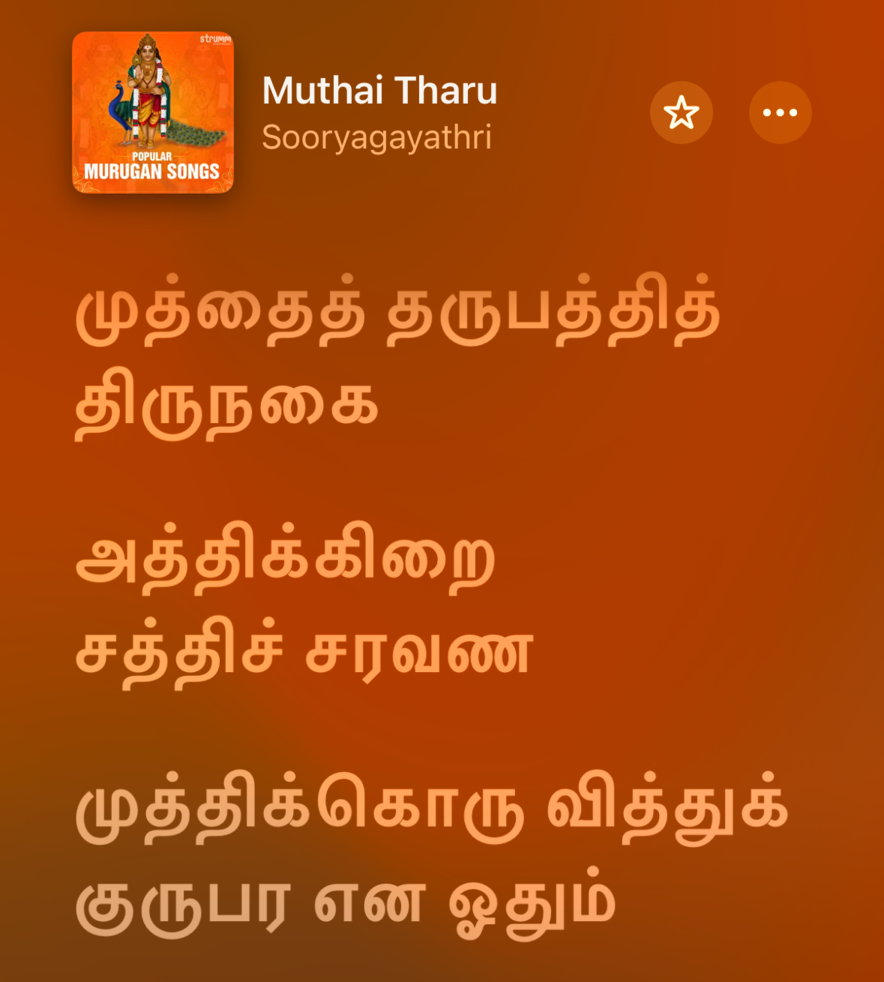

# How did I not know this before!

It was Friday. Fine day I would say, there have been worse ones but this was just fine. I had just reached my apartment, relaxed a while and turned on my playlist. A few songs went by and then it came. Rasaali (**ராசாளி)** meaning Falcon/Eagle (Falco Peregrinator found in the southern regions of India) , is also the title of a song in the movie *```Acham Yenbadu Madamaiyada```*. I have listened to this song multiple times previously but this was the first time I realized that it had something wonderful. 

Let’s go off the track for a bit now. Thiruppugazh (திருப்புகழ் - can be pronounced as Tiruppukal) is a very old ancient set of devotional songs dedicated to Lord Muruga by the poet-saint Arunagirinathar (அருணகிரிநாதர்). Thiruppugazh 6 Muththaiththaru (முத்தைத்தரு) is an iconic song from this set. A famous rendition of this song is by TM Sounderajan in the movie Arunagirinathar. 
<div class="videowrapper">
    <iframe  src="https://www.youtube-nocookie.com/embed/e3Sprso1bKQ?si=RIJW4bLFwIQDJWhK&amp;start=14" title="YouTube video player" frameborder="0" allow="accelerometer; autoplay; clipboard-write; encrypted-media; gyroscope; picture-in-picture; web-share" referrerpolicy="strict-origin-when-cross-origin" allowfullscreen></iframe>
</div>

Now, let’s do a small activity. Connect your headphones and play the above music video for a few seconds (*approximately 9 seconds from 0:14 to 0:23*). Then click the below video and listen for the same 9 seconds (*from 2:24 to 2:33*).

<div class="videowrapper">
    <iframe  src="https://www.youtube-nocookie.com/embed/QrLrsWwUp04?si=6zB65YVno5O3Q9-C&amp;start=144" title="YouTube video player" frameborder="0" allow="accelerometer; autoplay; clipboard-write; encrypted-media; gyroscope; picture-in-picture; web-share" referrerpolicy="strict-origin-when-cross-origin" allowfullscreen></iframe>
</div>

And THERE IT IS!, it hits like a missile, BOOM!! The striking similarity! The music, the lyrics, everything done here by Thamarai and AR Rahman is pure genius to me. The breathtaking visuals directed - no *conjured* by GVM, the nectar like voices of Sathya Prakash and Shashaa Tirupathi - all of these together elevates not just the music but also our spirits. 

```
And I think this is how art evolves, passing down through various generations and inspiring artists to create art that captivates everyone. The journey of a 15th Century poem and its shades, present in a 21st Century song is just absolutely delightful.
```

<div class="table-container">
    
    
</div>

(Try singing these in alternates, it fits perfectly and syncs so well !!) 

When we find something as interesting as this, what do we do ? SHARE. And that’s what I did.  I shared it with my friends. We all have that defunct Whatsapp group named “Trip Plan” where everything other than planning trips would be discussed. From this space I got two more ‘How did I not know this before’ - thank you Poojaa 🥂. 

1. The song Avalum Naanum uses the lyrics from the poem “Avalum Naanum Amudhum Thamizhum” by the 20th CE poet Bharathidasan (பாரதிதாசன்).
[http://eluthu.com/kavignar-kavithai/2023.html](http://eluthu.com/kavignar-kavithai/2023.html)
2. “Thendral Vandhu” a masterpiece by Ilayaraja inspired his son Yuvan to make the song “Idhu Varai”. The transition he does (below video) is just bliss.
[Idhu varai - song inspiration! | #Shorts | Throwback | Sun TV](https://www.youtube.com/watch?v=JuczdpHeY2M)