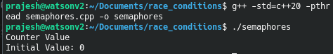

# Race Conditions

When two or more different processes or threads running concurrently try to access the same shared resource, a race condition can occur. This can lead to critical security issues and incorrect results.I first encountered race conditions while implementing a Gaussian blur using parallel algorithms. It was a great learning experience for me to understand and manage concurrent access to a shared resource (the image file content) across multiple threads.
<br>
<br>
Let us understand how an race condition occurs using a simple C++ program. Let there be a common variable called counter with an initial value of 0 and a function that increments the counter value 100000 times.

```cpp
int counter = 0; //let the counter be the shared resources.
void incrementor() {
	for (int i = 0; i < 100000; i++) {
        counter++; // Race condition occurs here
    }
}
```
Now let us add two threads that simultaneously calls this function. Since thread execution is non-deterministic and without proper synchronization, both threads may read and update the counter simultaneously, leading to lost updates and incorrect values. The following program illustrates this.

```cpp
#include <iostream>
#include <thread>
using namespace std;

int counter = 0; //let the counter be the shared resources.

void incrementor() {
	for (int i = 0; i < 100000; i++) {
        counter++; // Race condition occurs here
    }
}

int main()
{
	cout<<"Counter Value\n";
	cout<<"Initial Value: "<<counter<<"\n";

	thread thread1(incrementor);
	thread thread2(incrementor);
	//Ensure both threads finish execution before 
	//the program proceeds to print the final value.
	thread1.join(); 
    thread2.join();

	cout<<"Final Value: "<<counter<<"\n";
	return 0;
}
```
<br>

### Expected result vs Acutal result
Ideally the counter should be 200000 but on execution we get the following differenct result for each run.
<div class="table-container">
    
    
</div>

<br>

### Solution 1 - Mutex Locks
Mutex locks (short for "mutual exclusion") are used to ensure that only one thread can access a critical section at a time.

```cpp
#include <iostream>
#include <thread>
#include <mutex>
using namespace std;

int counter = 0; 
mutex mtx_lock; // Mutex Lock
void incrementor() {
	for (int i = 0; i < 100000; i++) {
		//Lock the section before access is shared between the threads
		lock_guard<mutex> lock(mtx_lock);
        counter++; 
    }
}

int main()
{
	cout<<"Counter Value\n";
	cout<<"Initial Value: "<<counter<<"\n";

	thread thread1(incrementor);
	thread thread2(incrementor);
	thread1.join(); 
    thread2.join();

	cout<<"Final Value: "<<counter<<"\n";
	return 0;
}
```
**How does this work**
- ```mtx_lock``` is a mutex used to protect the critical section (incrementing ```counter```).
- ```lock_guard``` is an RAII-based (Resource Acquisition Is Initialization) mutex wrapper that locks the mutex when the object is created and automatically releases it when it goes out of scope. More on [RAII here](https://en.cppreference.com/w/cpp/language/raii).
- Once a thread exits the loop iteration, the mutex is released, allowing another thread to acquire the lock.

<div class="table-container">
    
</div>
Now why does this **Mutex Lock** work ? - Without the mutex lock, counter++ would not be atomic. The race condition occurs like this:

```txt
    Thread 1 Reads counter (e.g., counter = 10).
    Thread 2 Reads counter (also counter = 10).
    Thread 1 Increments (counter = 11).
    Thread 2 Increments (counter = 11) (Thread 1's increment is lost).
```
But using a mutex ensures that - 
- One thread at a time enters the critical section.
- No updates to counter are lost.
- The final counter value is always 200,000 (100,000 * 2)

### Solution 2 - Semaphores
A semaphore is a synchronization mechanism (kind off like a bouncer who ensures the number of people entering the club doesnot exceed a limit) used to control access to a shared resource in multi-threading program. Unlike a mutex, which allows only one thread to access a critical section at a time, a semaphore can allow multiple threads up to a specified limit.

```cpp
#include <iostream>
#include <thread>
#include <semaphore>
using namespace std;

int counter = 0;
counting_semaphore<1> sem(1);  // Binary semaphore (acts like a mutex and can take a value of n)

void incrementor() {
    for (int i = 0; i < 100000; i++) {
        sem.acquire();  // Wait - Only one thread can enter
        counter++;
        sem.release();  // Signal - Allow next thread
    }
}

int main() {
    cout << "Counter Value\n";
    cout << "Initial Value: " << counter << "\n";

    thread thread1(incrementor);
    thread thread2(incrementor);

    thread1.join();
    thread2.join();

    cout << "Final Value: " << counter << "\n";  
    return 0;
}
```

- We create a **counting_semaphore** (`<1>`) initialized to `1`, meaning only **one** thread can access the critical section at a time.
- If initialized to `N`, it would allow `N` threads to enter concurrently.
- `acquire()`: If another thread is already using `counter`, it **blocks** the current thread.
- `release()`: Once done, it **signals** the next waiting thread to proceed.

Note: <i>The counting_semaphore is available from C++20 and not on the previous versions.</i>




Apart from the above solutions, there are other approaches to address race condtion such as atomic operations and read-write locks.
To prevent race conditions, one can minimize the use of shared resoruces, use thread safe data structures like concurrent queues, keep the critical sections small and follow consistent locking and unlocking.